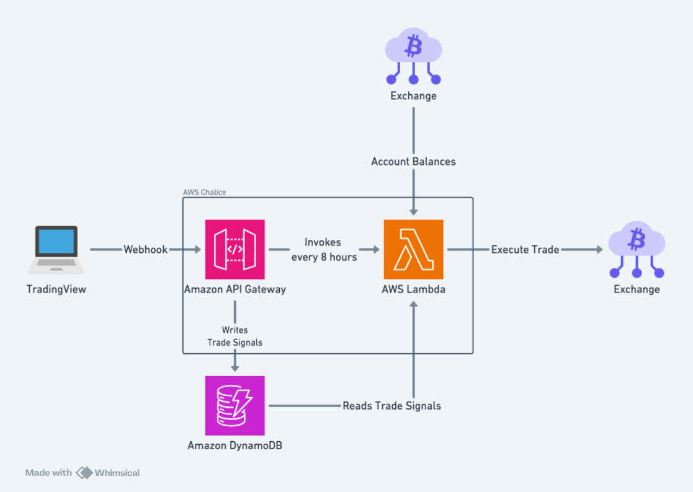

# Crypto Automation System
Welcome to my trading automation system! Designed specifically for traders with strategies developed in TradingView, this system streamlines the transition from manual to automated execution. By eliminating emotional bias, ensuring consistent execution, and maintaining constant connectivity, our system empowers you to optimize your trading strategies with greater efficiency and confidence—all while keeping your private keys secure and minimizing costs to less than $1 a month.

# System Design
So, how does it work? Our system seamlessly integrates four key components: TradingView, AWS Chalice, AWS DynamoDB, and AWS Secrets Manager.

## TradingView
- **Function**: Hosts your custom trading strategies, defining when to buy or sell an asset and specifying the trading timeframe. All strategies must operate on the same timeframe.
- **Alerts**: Sends custom payloads via webhooks to designated endpoints whenever an alert is triggered.

## AWS Chalice
- **Function**: Simplifies the development and deployment of our *REST API* and *Lambda Function*, handling the logic for processing and executing trade signals.
- **REST API**: Receives incoming trade signals from TradingView and stores them in DynamoDB. If the signal is a stop loss, the trade is executed immediately; otherwise, it is saved for further processing.
- **Lambda Function**: Executes trades based on signals stored in DynamoDB. It is triggered on the same timeframe as your TradingView strategy. For instance, if your strategy operates on an 8-hour timeframe, the Lambda function is invoked every 8 hours, 1 minute after the hour, to check for and act upon any trade signals.
- **Pricing**: Completely free; we stay comfortably within the AWS free tier limits, which allows for up to 1 million invocations per month at no cost.

## AWS DynamoDB
- **Function**: Serves as an intermediary database to store processed trades, enabling precise account allocation and advanced trade execution strategies, such as buy-side boost. Without this intermediary, we would be restricted to processing trade signals sequentially, which becomes a bottleneck when multiple signals occur simultaneously.
- **Pricing**: Completely free; we comfortably operate within DynamoDB's free tier limits, which provide up to 25 WCUs and RCUs per month at no cost.

## AWS Secrets Manager
- **Function**: Securely stores sensitive information, such as exchange API keys.
- **Pricing**: $0.30 per month per secret. This is the only paid service we use, and the investment in security is well worth it.



# Trade Execution
In this section, we’ll provide a detailed overview of how our system executes trades and allocates the correct percentage to each strategy, including the two key execution strategies: multi-strategy execution and buy-side boost. We’ll also cover important guidelines to ensure the system operates as intended.

Our system executes trades using **limit orders** because some exchange APIs don't support market orders, and maker fees are often significantly lower than taker fees. However, we make our limit orders behave like market orders by adjusting the order price based on the last traded price of the market, plus or minus a defined **increment percent**, depending on whether it's a buy or sell order. It's important to adjust this **increment percentage** according to your account value to ensure your limit orders function effectively as market orders.

## Portfolio Allocation
Our system automatically handles portfolio allocation to each strategy based on user-defined percentages set in the `strategy_config.json` file. 

**Important:** Configured percentages should not add up to more than 98%. We reserve 2% of the account to ensure there's always cash available for fees.

## Execution Strategies
There are two execution strategies available: Multi-Strategy Allocation and Buy-Side Boost.

### Multi-Strategy Allocation
This execution strategy ensures the defined percentage in `strategy_config.json` is used when executing on the strategy.

**How does it work?**
- When there are no active trades, it's fairly simple: We take the total account value in USD and multiply it by the specified percentage to determine the allocation for a given strategy.
- However, when you're already in a trade and need to allocate for the next trade signal, things get a bit more complex: But the idea remains the same—we calculate the total account value in USD and multiply it by the strategy's percentage.
- The challenge is that to accurately determine the account value, we first need to figure out how much USD was originally allocated to all active trades. This means calculating the account's value before factoring in any unrealized gains. This is handled in our function `get_total_usd()`.

This ensures that our system precisely allocates to each strategy as intended. 

### Buy-Side Boost
This advanced execution strategy is the most efficient way to allocate capital to multiple strategies. The idea is that instead of only using a portion of your account, you should use all of your account and reallocate as more trades are entered. 

To understand how this works, let's introduce a concept called **trade precedence**. Trade precedence is determined based on the incoming and active trades, meaning we reassess which trade has precedence every time a strategy is triggered to enter the market. The strategy with trade precedence receives the otherwise available capital of your account.

**Otherwise Available Capital** is calculated by summing the percentages in `strategy_config.json` assigned to strategies that are not currently active.

**Important:** Ensure that configured percentages are not the same so trade precedence can be correctly determined.

Let’s walk through an example to clarify this concept. Suppose we have defined the following allocation percentages for three strategies:
- BTC/USD: 0.2
- ETH/USD: 0.25
- SOL/USD: 0.5

Now suppose we have the following sequence of trades: 
1. BTC/USD Buy
2. ETH/USD Buy
3. BTC/USD Sell & ETH/USD Sell
4. BTC/USD Buy & SOL/USD Buy
5. BTC/USD Sell & SOL/USD Sell 

At step 1, since BTC/USD is the only incoming trade and we have no active trades, it receives trade precedence. Because BTC/USD has trade precedence, we allocate both the BTC/USD percentage and the Otherwise Available Capital percentage, which is 0.2 + 0.75 = 0.95. Therefore, we buy BTC/USD with 95% of our account value.

At step 2, we need to determine which trade has precedence between the incoming trade (ETH/USD) and the active trade (BTC/USD). Since ETH/USD has a higher allocation percentage than BTC/USD, it receives trade precedence. To adjust, we sell a portion of our BTC/USD position so that its allocation matches the defined percentage of 0.2.

After the sell, we allocate 0.25 to ETH/USD, plus the Otherwise Available Capital percentage, which is now 0.5. This means we purchase ETH/USD using 75% of our total account value. Our portfolio is now composed of 20% BTC and 75% ETH.

At step 3, we sell our entire BTC/USD and ETH/USD positions.

At step 4, we determine trade precedence between the two incoming trades (BTC/USD and SOL/USD). SOL/USD receives precedence due to its higher defined allocation percentage. As a result, we allocate 20% of our portfolio to BTC/USD and 75% to SOL/USD.

At step 5, we sell our entire positions in BTC/USD and SOL/USD.

**Important:** To ensure buy-side boost functions as intended, avoid having ties between the defined allocation percentages in `strategy_config.json`.

# Usage
In this section, I’ll guide you through the essential user configurations, including setting your portfolio allocation split, choosing your execution strategy, and reviewing guidelines to ensure the system functions as intended.

## Allocation Split
First, open `strategy_config.json` and adjust the values next to each percentage to reflect your desired allocation split. Ensure the top-level key matches the symbol in TradingView. For example, if your strategy is based on SOLUSDT in TradingView, the key should also be SOLUSDT.

## Increment Percent
Next, open `app.py` and locate lines 28 and 56, where a parameter called `increment_pct` is set to a float. Adjust this value as needed to ensure your limit orders are filled promptly (e.g. 0.001 is .1%).

**Line 28:**

`order = trade_execution.execute_long_stop(exchange, trade_out, increment_pct=0.001)`

**Line 56:**

`orders = trade_execution.buy_side_boost(exchange, trades, increment_pct=0.001)`

## Execution Strategy
To switch between multi-strategy allocation and buy-side boost, edit line 56 in `app.py` as follows:

**Multi-Strategy Allocation:**

`orders = trade_execution.multi_strategy_allocation(exchange, trades, increment_pct=0.001)`

**Buy-Side Boost:** 

`orders = trade_execution.buy_side_boost(exchange, trades, increment_pct=0.001)`

## Important Guidelines
This section is to go over important guidelines to ensure the system works as intended.
- The account should be **solely** used for trading automated strategies **on the same timeframe**. 
- Ensure all trades are closed in the account before activating the system, as open trades will disrupt account value calculations.
- For similar reasons as above, avoid using this account for external crypto transfers. All strategies must start fresh, either with no trades at all or with the last trade fully closed.
- Configured percentages in `strategy_config.json` should not exceed 98%, leaving 2% available for fees.
- If using Buy-Side Boost, ensure that configured percentages in `strategy_config.json` are not the same, allowing for proper calculation of trade precedence.

# Getting Started

## Project setup

To get started go ahead and clone the repository in your local workspace by running the following command:

```bash
$ git clone https://github.com/lukenew2/crypto_auto_trading.git
```

Navigate your terminal inside the project directory and create a new virtual environment with python 3.10 and install both requirements.txt files.  

- requirements.txt - Installs chalice and pytest used for application deployment and unit testing respectively.
- crypto_bot/requirements.txt - Installs packages used within application.

```bash
$ python3.10 -m venv venv310
$ . venv310/bin/activate
$ pip install -r requirements.txt
$ pip install -r crypto_bot/requirements.txt
```

From here on forward I’m assuming that you have the AWS CLI set up properly so we can create your AWS resources from the command line.  

## DynamoDB

First, you’ll create your database that will store incoming trade signals from TradingView.  Make note of the **table name.** This field can be changed to whatever you want.  For example, if you want to have separate tables for dev/prod you can add a -dev or -prod to the end of the name.

If you’re on Linux/OS run the following in the terminal:

```bash
$ aws dynamodb create-table \
    --table-name tradesignals \
    --attribute-definitions \
        AttributeName=ticker,AttributeType=S \
        AttributeName=create_ts,AttributeType=S \
    --key-schema \
        AttributeName=ticker,KeyType=HASH \
        AttributeName=create_ts,KeyType=RANGE \
    --provisioned-throughput \
        ReadCapacityUnits=5,WriteCapacityUnits=5 \
    --table-class STANDARD
```

Or if you’re on Windows:

```bash
$ aws dynamodb create-table ^
    --table-name tradesignals ^
    --attribute-definitions ^
        AttributeName=ticker,AttributeType=S ^
        AttributeName=create_ts,AttributeType=S ^
    --key-schema ^
        AttributeName=ticker,KeyType=HASH ^
        AttributeName=create_ts,KeyType=RANGE ^
    --provisioned-throughput ^
        ReadCapacityUnits=5,WriteCapacityUnits=5 ^
    --table-class STANDARD
```

You should get an output that looks something like this:

```json
{
    "TableDescription": {
        "AttributeDefinitions": [
            {
                "AttributeName": "ticker",
                "AttributeType": "S"
            },
            {
                "AttributeName": "create_ts",
                "AttributeType": "S"
            }
        ],
        "TableName": "tradesignals",
        "KeySchema": [
            {
                "AttributeName": "ticker",
                "KeyType": "HASH"
            },
            {
                "AttributeName": "create_ts",
                "KeyType": "RANGE"
            }
        ],
        "TableStatus": "CREATING",
        "CreationDateTime": "2023-03-29T12:11:43.379000-04:00",
        "ProvisionedThroughput": {
            "NumberOfDecreasesToday": 0,
            "ReadCapacityUnits": 5,
            "WriteCapacityUnits": 5
        },
        "TableSizeBytes": 0,
        "ItemCount": 0,
        "TableArn": "arn:aws:dynamodb:us-east-1:111122223333:table/tradesignals",
        "TableId": "60abf404-1839-4917-a89b-a8b0ab2a1b87",
        "TableClassSummary": {
            "TableClass": "STANDARD"
        }
    }
}
```

Take note of the **TableArn** field and copy the value to your clipboard.  Now, open the file *crypto_automation_system/crypto_bot/.chalice/policy-prod.json* and paste the TableArn value inside the **DynamoDB** Resource field.  It should look something like this:

```json
      {
        "Action": [
          "dynamodb:PutItem",
          "dynamodb:DeleteItem",
          "dynamodb:UpdateItem",
          "dynamodb:GetItem",
          "dynamodb:Scan",
          "dynamodb:Query"
        ],
        "Resource": [
          "arn:aws:dynamodb:us-east-1:111122223333:table/tradesignals"
        ],
        "Effect": "Allow"
      },
```

This gives your automation system permission to read/write to the database so whenever TradingView sends signals to your application you will be able to write the signals to the table.

Next, open *crypto_automation_system/crypto_bot/.chalice/config.json* and paste the table name in the field **TABLE_NAME**. If you’re creating two tables, one for dev/prod, you would put the respective name in the respective stage.  Your file should look something like this:

```json
{
  "version": "2.0",
  "app_name": "crypto_bot",
  "environment_variables": {
    "EXCHANGE_NAME": "gemini"
  },
  "stages": {
    "dev": {
      "api_gateway_stage": "dev",
      "autogen_policy": false,
      "iam_policy_file": "policy-dev.json",
      "environment_variables": {
        "TABLE_NAME": "tradesignals-dev",
        "SECRET_NAME": "YOUR-API-SECRET",
        "SANDBOX": "True"
      }
    },
    "prod": {
      "api_gateway_stage": "prod",
      "autogen_policy": false,
      "iam_policy_file": "policy-prod.json",
      "environment_variables": {
        "TABLE_NAME": "tradesignals-prod",
        "SECRET_NAME": "YOUR-API-SECRET",
        "SANDBOX": "False"
      }
    }
  }
}
```

And boom!  You’ve created your DynamoDB table and given your application the required permissions and configurations.

**Developer Note**: If you’re using the dev environment, you will also need to modify the policy-dev.json file in a similar way as we did the policy-prod.json file above.

## Generate API Keys

Next, you need to give your application access to your trading account.  You do this by generating API keys on your exchange, storing those keys in AWS Secrets Manager, and giving your application sufficient permission to retrieve said keys.   

Generating API keys is different for every exchange.  For instructions, google how to generate API keys on your exchange.  **Important** - your keys only need sufficient permissions to view account balances and create orders.  It is best practice to give your keys minimum permissions required.  Once you have your keys store them in a safe place.  

## Secrets Manager

Now that you have your API keys for your exchange, You’ll securely store them in AWS Secrets Manager and give your application permission to retrieve them.  

1. Open the Secrets Manager console at  https://console.aws.amazon.com/secretsmanager/
2. Choose **Store a new secret**.
3. On the **Choose secret type** page, do the following:
    1. For **Secret type**, choose **Other type of secret**.
    2. In **Key/value pairs**, enter your secret in JSON **Key/value** pairs as shown below.
    
    ```json
    {
        "api-key": "YOUR-API-KEY",
        "api-secret": "YOUR-API-SECRET"
    }
    ```
    
    You do not need to change anything else on this page.  Choose next.
    
4. On the **Configure secret** page, do the following:
    1. Enter a descriptive **Secret name** and **Description**. Secret names must contain 1-512 Unicode characters.  Take note of the secret name.  We will use it later.
    2. Choose next
5. On the **Review** page, review your secret details, and then choose **Store**.
    
    Secrets Manager returns to the list of secrets. If your new secret doesn't appear, choose the refresh button.
    
6. Click on your newly created secret and copy the **Secret ARN** to your clipboard.  Open *crypto_automation_system/crypto_bot/.chalice/policy-prod.json* and paste the Secret ARN value inside the **Secrets Manager Resource field**.  It should look something like this:
    
    ```json
          {
            "Action": [
              "secretsmanager:GetSecretValue"
            ],
            "Resource": [
              "arn:aws:secretsmanager:us-east-1:111122223333:secret:secretname"
            ],
            "Effect": "Allow"
          }
    ```
    
7. Now, open *crypto_automation_system/crypto_bot/.chalice/config.json* and paste your secret name in the field **SECRET_NAME** within the prod stage.  It should look something like this:
    
    ```json
    {
      "version": "2.0",
      "app_name": "crypto_bot",
      "environment_variables": {
        "EXCHANGE_NAME": "gemini"
      },
      "stages": {
        "dev": {
          "api_gateway_stage": "dev",
          "autogen_policy": false,
          "iam_policy_file": "policy-dev.json",
          "environment_variables": {
            "TABLE_NAME": "tradesignals",
            "SECRET_NAME": "secretname-dev",
            "SANDBOX": "True"
          }
        },
        "prod": {
          "api_gateway_stage": "prod",
          "autogen_policy": false,
          "iam_policy_file": "policy-prod.json",
          "environment_variables": {
            "TABLE_NAME": "tradesignals",
            "SECRET_NAME": "secretname-prod",
            "SANDBOX": "False"
          }
        }
      }
    }
    ```
    

And Kaboom!  You’ve created a secret to securely store your exchange’s API keys and gave your application sufficient permissions to access the keys.  

**Developer Note:** Most exchanges offer a sandbox environment that provides the same functionality as the actual exchange to enable testing in your application without affecting your actual account.  If you have API keys for your exchange’s sandbox, you can create another secret in AWS Secrets Manager to store the sandbox’s API keys.  Copy the Secret Name within the dev stage of our config.json file and the Secret ARN in the policy-dev.json file.

## Deployment

Open *crypto_automation_system/crypto_bot/chalicelib/strategy_config.json* and adjust how much of your portfolio you want to allocate to each strategy by adjusting the “**percentage**” field to your desired allocation.  (**Important**: the values must not add to more than 0.98 to ensure you have enough for fees).

```json
{
    "BTCUSD": {
        "symbol": "BTC/USD",
        "currency": "BTC",
        "percentage": 0.20,
        "stop_loss": 0.03
    },
    "ETHUSD": {
        "symbol": "ETH/USD",
        "currency": "ETH",
        "percentage": 0.25,
        "stop_loss": 0.03
    },
    "ADAUSD": {
        "symbol": "ADA/USD",
        "currency": "ADA",
        "percentage": 0,
        "stop_loss": 0.20
    },
    "SOLUSD": {
        "symbol": "SOL/USD",
        "currency": "SOL",
        "percentag*": 0.53,
        "stop_loss": 0.066
    }
}
```

To deploy, navigate your terminal inside the crypto_bot directory run `chalice deploy --stage prod`:

```bash
$ chalice deploy --stage prod
Creating deployment package.
Creating IAM role: crpyto_bot-prod
Creating lambda function: crpyto_bot-prod
Creating Rest API
Resources deployed:
  - Lambda ARN: arn:aws:lambda:us-west-2:12345:function:crpyto_bot-prod
  - Rest API URL: https://abcd.execute-api.us-west-2.amazonaws.com/api/
```
Make note of the Rest API URL.  You will need it to setup TradingView to send alerts to your application.

If you need to delete your application for whatever reason you can run `chalice delete --stage prod`:
```bash
$ chalice delete --stage prod
Deleting Rest API: abcd4kwyl4
Deleting function aws:arn:lambda:region:123456789:crpyto_bot-prod
Deleting IAM Role crpyto_bot-prod
```

## Testing

In this part, you will test your two deployed Lambda functions:

1. **crypto_bot-prod**: A REST API with a single route, **receive_trade_signals**.
2. **crypto_bot-prod-execute_trade_signals**: Executes trade signals stored in the database.

### Testing the REST API

To test the REST API, follow these steps:

1. **Prepare the Testing Tool**: Use a tool like Insomnia or Postman to send HTTPS requests to your endpoint. Set the request type to POST.
  
2. **Copy the Endpoint URL**: Your endpoint URL should look similar to `https://abcd.execute-api.us-west-2.amazonaws.com/api/receive_trade_signals`. Copy this URL and paste it into your testing tool.

3. **Create a JSON Body**: Copy and paste the following JSON into your request's body:

```json
{
  "time": "2024-04-04T16:00:02Z",
  "ticker": "BTCUSD",
  "order_action": "buy",
  "order_price": "67656.77",
  "order_comment": "long"
}
```

4. **Send the Request**: Send the POST request to the endpoint.

5. **Check CloudWatch Logs**: In the AWS Management Console, go to CloudWatch Logs and select the **crypto-bot-prod** log group. Look for a log detailing the process of writing the trade signal to your database.

### Testing the Execution of Trade Signals

To test the function that executes trade signals, follow these steps:

1. **Navigate to Lambda Functions**: In the AWS Management Console, search for **Lambda**. Then, in the left sidebar, select **Functions**. You should see two functions:
    - **crypto_bot-prod**: Writes incoming trade signals to your database.
    - **crypto_bot-prod-execute_trade_signals**: Executes trade signals stored in the database.
2. **Choose the Function**: Select the **crypto_bot-prod-execute_trade_signals** function and then choose **Test**.
3. **Create a New Event**: Select **Create new event**.
4. **Input Event JSON**: In the **Event JSON** editor, paste the following JSON:

```json
{
  "id": "9dbbc12b-0e1a-4c90-9929-e5475c68e9e4",
  "detail-type": "Scheduled Event",
  "source": "aws.events",
  "account": "123456789012",
  "time": "2019-10-08T16:53:06Z",
  "region": "us-east-1",
  "resources": [
    "arn:aws:lambda:us-east-1:111122223333:function:crypto_bot-prod-execute_trade_signals"
  ],
  "detail": {},
  "version": ""
}
```

5. **Run the Test**: Choose **Test** to execute the function. After a few seconds, a green checkmark should appear, indicating successful execution.
6. **Check CloudWatch Logs**: For more details about the test, go to CloudWatch Logs and look at the logs for the function.

## TradingView Web-hooks

Last step is to configure your strategy in TradingView to send alerts to your new REST API Endpoint.  Create a new alert off your strategy and in the message paste the JSON below:

```json
{
    "time": "{{timenow}}",
    "ticker": "{{ticker}}",
    "order_action": "{{strategy.order.action}}",
    "order_price": "{{strategy.order.price}}",
    "order_comment": "{{strategy.order.comment}}"
}
```

And then in the notifications select Webhook URL and paste your REST API’s endpoint with receive_trade_signals after the slash.  It should look something like this:

```
https://abcd.execute-api.us-west-2.amazonaws.com/prod/receive_trade_signals
```